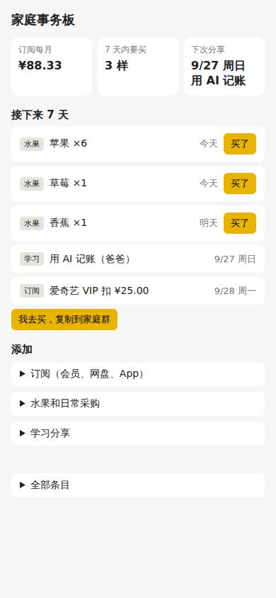

# learn-alongside：用一个家庭事务 App 学 pstack

这个仓库用一个真实的小项目，把 [pstack](https://github.com/backnotprop/pstack) 从头到尾跑了一遍。项目是一个家庭 TODO App，管三件事：订阅费用、日常水果采购、家庭学习分享。

过程中每一步做了什么、为什么这么做、证据在哪，都留在了仓库里。你可以照着读，也可以直接拿去用。

## 我从你的描述里读出的目的

你说的是"用 pstack 做一个 TODO App，演示需求澄清、目标明确、路线规划、路径纠正"。我读出了三层意思：

1. **你想学的是 pstack 的设计思路，App 只是载体。** 所以文档按你列的四种能力组织，每一种都对应 pstack 里具体的机制和文件，而不是泛泛的方法论。
2. **你想以后自己用上。** 所以 pstack 已经装进了本仓库的 `.claude/`。用 Claude Code 打开这个仓库，直接输入 `/poteto-mode` 就能用。另外还附了一份可以直接复制的提示词速查。
3. **家里的问题是真问题。** 所以 App 做成了能真正用的样子：手机优先、数据存在本机、刷新不丢，也有测试证明它算得对。

## 先说一个重要的反差

pstack 的作者在 README 里写道："i don't believe in planning. the best spec is code."（我不相信规划，最好的规格说明就是代码。）

pstack 里**没有**一个叫"需求澄清"或"路线规划"的技能。你期待的四种能力是分散在 playbook（执行手册）、skill（技能）和 principle（原则）里的机制：

| 你想要的能力 | pstack 里对应的机制 | 这次演示在哪 |
|---|---|---|
| 需求澄清 | poteto-mode 的提问规则：能跑一下就知道答案的问题不问人，做原型测出来；只把偏好和产品方向留给人。Prototype 执行手册 | [docs/01-需求澄清.md](docs/01-需求澄清.md) |
| 目标明确 | figure-it-out 的 Phase A：把"做完"写成能判真假的断言。prove-it-works 原则：在真实产物上验证 | [docs/02-目标明确.md](docs/02-目标明确.md) |
| 路线规划 | 先定数据形状（model-the-domain），吞吐检查点（Feature 第 3 步），拆成可验证的小单元（sequence-verifiable-units） | [docs/03-路线规划.md](docs/03-路线规划.md) |
| 路径纠正 | attack-the-premise、fix-root-causes、architect 的推翻重来信号、show-me-your-work 决策日志、encode-lessons-in-structure | [docs/04-路径纠正.md](docs/04-路径纠正.md) |

先读 [docs/00-pstack设计地图.md](docs/00-pstack设计地图.md)，建立整体印象，再按顺序读 01 到 05。



## 仓库里有什么

```
docs/            学习文档（从这里开始读）
  00-pstack设计地图.md   pstack 的四层结构和七个核心设计思路
  01-需求澄清.md         8 个问题怎么分类、原型怎么替你做决定
  02-目标明确.md         从"做个 TODO App"到 7 条能判真假的断言
  03-路线规划.md         数据形状、吞吐检查点、提交顺序本身就是论证
  04-路径纠正.md         这次真实发生的 4 次纠正 + 1 次演练
  05-提示词速查.md       你以后在 Claude Code 里可以直接复制的提示词和练习
app/             家庭事务板 App（零依赖，纯 HTML + JS）
  domain.js      领域模型，纯函数
  app.js         浏览器层：存储、表单校验、渲染
test/            行为测试（node --test）
test-e2e/        真浏览器端到端检查（Playwright）
scripts/
  verify.sh      完成条件的唯一裁判，输出 VERIFIED 才算做完
  mutation-check.mjs  往代码里植入已知 bug，证明测试真的会失败
  serve.mjs      零依赖本地服务器
prototype/       一次性原型和实验（做完决定就可以删）
category-film/   独立子项目：范畴之画，一部在浏览器里放映的知识短片（Vite + React），见它自己的 README
decisions.tsv    决策日志（show-me-your-work 格式），GitHub 会渲染成表格
.claude/         pstack 本体（47 个技能 + 2 个子代理），来自上游 commit 157aae3，MIT 许可
CLAUDE.md        给 Claude Code 的项目说明
```

## 用起来

需要 Node.js 18 或更高版本。

```bash
npm start            # 打开 http://localhost:5173 ，点"载入示例数据"看效果
npm test             # 行为测试，零依赖
```

家里人的手机和电脑连同一个 Wi-Fi 时，手机上打开 `http://<电脑的局域网 IP>:5173` 就能用。注意每台设备的数据是各自独立的，[docs/04](docs/04-路径纠正.md) 讲了为什么，以及这件事留给你做什么决定。

跑完整验证需要先装一次 Playwright 的浏览器：

```bash
npm install
npx playwright install chromium
npm run verify       # 行为测试 + 变异检查 + 真浏览器端到端，最后一行是 VERIFIED
```

## 在 Claude Code 里用 pstack

用 Claude Code 打开本仓库后，下面这些都可以直接用：

```text
/poteto-mode 新任务。给学习分享加"轮流主讲"，每次自动排到下一个人。
/how 这个 app 的日程是怎么算出来的？
/show-me-your-work 把刚才的决策整理给我看
```

pstack 默认配置的是 Cursor 里的模型（如 grok、gpt-5.6-sol），Claude Code 里没有这些。第一次用时先运行 `/setup-pstack`，把各个角色都选成 `inherit-parent`（沿用当前对话的模型）即可。

## 这次演示在哪些地方偏离了 pstack

诚实说明，免得你以为 pstack 就是这么用的：

- **没有把写代码委派给子代理。** Feature 执行手册第 4 步要求委派，目的是让写代码的和审代码的分开。这次为了控制成本，在一个会话里做完了。你自己用时建议保留这一步。
- **没有用多模型的 `/arena` 和 `/interrogate`。** 这两个技能要多个模型家族并行，是 pstack 的重要卖点。这次的设计足够小，而且可以撤销，按 laziness-protocol 原则跳过了。
- **决策日志没有做跨模型审查。** show-me-your-work 要求换一个模型家族来审日志。这次是我自己审的，所以 docs/04 末尾的 Attention 部分只算自审。
- **没有用 `check-plan.mjs`。** 它检查的是多 PR 大计划的格式（每个 PR 十条验证通道等），对这个单人小项目来说太重了。docs/03 讲了什么时候该用它。
