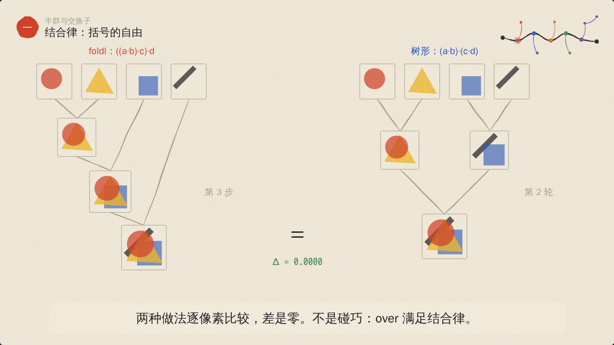
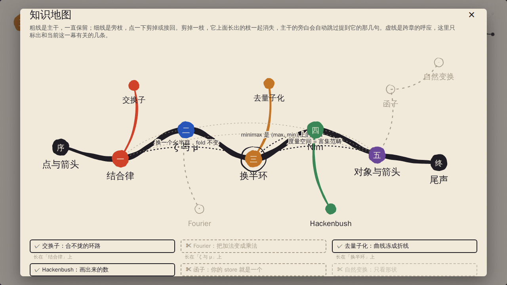

# 范畴之画

一部在浏览器里放映的知识短片。讲的人是一位画了半辈子抽象画、后来改读哲学的画家，他说自己这辈子只画过两样东西：点，和点之间的箭头。

片子从一张透明画纸讲起，经过 Möbius 反演、Fourier、热带代数、Nim 和 Hackenbush，最后拆掉所有脚手架，只剩范畴。观众设定为写过函数式代码、用过 Redux / Elm 这类单向数据流的开发者，所以每一幕都会落回 `reduce`、`map`、reducer、CRDT 这些你每天碰到的东西。



## 放映

```bash
cd category-film
npm install
npm run dev          # 打开终端里给出的地址，点“开始放映”
```

也可以先构建再用静态服务器放：`npm run build && npm run preview`。

| 按键 | 作用 |
|---|---|
| 空格 | 播放 / 暂停 |
| ← / → | 上一拍 / 下一拍 |
| M | 打开知识地图，剪枝 |
| C | 字幕开关 |
| V | 用浏览器自带语音朗读旁白 |
| F | 全屏 |

进度条按幕着色，点哪里跳到哪里。控制台里也可以 `__film.seek(120)`。

## 发布到 GitHub Pages

构建产物 `dist/` 是纯静态文件，资源路径都是相对的（`vite.config.js` 里 `base: './'`），放在任何子路径下都能打开。

仓库里的 [.github/workflows/category-film-pages.yml](../.github/workflows/category-film-pages.yml) 会在每次改动 `category-film/` 时运行 `npm ci`、`npm test`、`npm run build`。只有**默认分支**上的这次构建会发布到 Pages，其他分支只跑测试和构建，相当于 CI。

第一次发布前，需要仓库管理员在 GitHub 上做一次设置：**Settings → Pages → Build and deployment → Source 选 “GitHub Actions”**。之后把改动合进默认分支，或在 Actions 页面对默认分支手动运行这个 workflow，片子就会出现在 `https://<用户名>.github.io/<仓库名>/`。

注意：私有仓库需要 GitHub Pro / Team / Enterprise 才能开启 Pages，而且除 Enterprise 的访问控制外，发布出去的页面是**所有人都能打开**的。

## 片子讲什么

一条主线贯穿全片：**我们一直在换“加法”是什么。** 叠画纸、沿偏序累加、取最小、异或，最后是箭头的组合本身。

```
序 ── 一 结合律 ── 二 ζ 与 μ ── 三 换半环 ── 四 Nim ── 五 对象与箭头 ── 终
        │              │             │            │            │
      交换子         Fourier       去量子化    Hackenbush      函子
                                                               │
                                                            自然变换
```

横线是主干，竖线是旁枝。完整版 13 幕、17 分 14 秒；把旁枝全剪掉，只看主干，9 分 16 秒。每一幕的场景、要点和跨章呼应见 [docs/知识地图.md](docs/知识地图.md)。

## 剪枝

按 M 打开地图，点旁枝就剪掉，再点一次接回。剪枝结果写进地址栏（`?prune=fourier,functor`），把链接发给别人，对方看到的是同一个剪辑。



剪枝有三条保证，都由测试逐一检查（6 个旁枝的全部 64 种剪法都跑一遍）：

1. **主干剪不掉。** 主干的每一幕始终都在，顺序不变。
2. **剪一枝，连根带叶。** 剪掉“函子”，长在它上面的“自然变换”一起消失。
3. **主干不会提到已经被剪掉的东西。** 主干里某一拍的旁白如果要用到某个旁枝（比如 Nim 那一幕说“异或也有自己的 Fourier 变换”），这一拍会声明 `needs: ['fourier']`。Fourier 被剪掉，这一拍就不播，后面的拍自动前移，动画跟着一起走。

剪枝时播放头不会乱跳：当前这一拍还在，就停在同一拍的同一进度；这一拍没了，就回到本幕开头；整幕没了，就去下一个还在的幕。

## 调节

所有旋钮在 [src/film.config.js](src/film.config.js)：

| 字段 | 作用 |
|---|---|
| `pace.charsPerSecond` / `pad` / `minBeat` | 每一拍的时长 = 旁白字数 ÷ 语速 + 停顿。改语速，整部片子的节奏一起变，字幕和动画不会错位 |
| `palette` | 颜色。每一章的主色在 `src/core/graph.js` 的 `CHAPTERS` 里引用这里的名字 |
| `fonts` | 正文、数学、代码三种字体 |
| `defaults` | 初始速度、是否开字幕和朗读、默认剪掉哪些枝 |
| `speeds` | 速度下拉框里的选项 |

地址栏参数会覆盖默认值：`?prune=…`、`?speed=1.25`、`?t=90`（从 90 秒开始）、`?autoplay=1`、`?chrome=0`（隐藏控制条，适合投屏）。

改旁白只需要改对应场景文件里的 `say`；拍的时长会自动重新计算。某一拍需要固定时长（比如一局 Nim 要演够 16 秒），写 `dur: 16`。

## 架构：一部片子就是一个纯函数

写过 Elm 或 Redux 的话，这套结构你应该很熟悉：

```
URL ──parse──▶ state ──dispatch(action)──▶ reducer ──▶ state'
                 │
                 ├─ derive(state.pruned) ──▶ timeline      （纯：地图 + 场景 + 剪枝 → 时间线）
                 │
                 └─ Stage(timeline, state.t) ──▶ SVG      （纯：同一个 t 永远画出同一帧）
```

- **画面是时间的纯函数。** 每一幕导出 `beats`（旁白分拍）和 `View({ clock })`。`clock.p('拍名')` 给出这一拍的进度 0..1，动画只依赖它。所以任意跳转、倒放、改速度都不需要“补帧”，测试里可以在 Node 中把每一拍渲染出来比对。
- **随机也是确定的。** 笔触的抖动来自带种子的噪声（`src/paint/brush.js`），同一个种子永远画出同一根线。
- **屏幕上的数都是算出来的。** Δ = 0.0000、缺口 1.414、φ(12) = 4、A→E 最短 10 分钟、BR = {0|1}、½ + ½ − 1 = 0……都来自 `src/math/` 里的函数，测试证明它们说的是真话。
- **副作用只在一处。** 时钟（requestAnimationFrame）、键盘、地址栏、语音合成都在 `src/player/effects.js`，它们只读 state、只发 action。

```
src/
  film.config.js        可调的旋钮
  film.js               装配：地图 + 场景 + 节奏 → derive(pruned)
  core/
    graph.js            知识地图：节点顺序、主干/旁枝、跨章连线
    prune.js            剪枝规则
    timeline.js         compose / locate / makeClock / remap / stepBeat
    reducer.js          播放器的全部状态变化
    url.js              state ⇄ 地址栏
  math/                 每一幕背后的真实运算（纯函数）
  paint/                笔触几何（纯）与画笔组件
  map/MapView.jsx       知识地图的画法，片头、小地图、剪枝面板、片尾共用
  scenes/               一幕一个文件，index.js 是登记表
  player/               App（唯一的 useReducer）、Stage、控制条、剪枝面板、副作用
test/                   Vitest：剪枝、时间线、reducer、URL、数学、逐拍渲染
e2e/smoke.mjs           Playwright：在真浏览器里放一遍构建产物
```

## 加一幕

1. 在 `src/core/graph.js` 的 `NODES` 里加一个节点。放在哪个位置，就在哪儿播放；写了 `parent` 就是旁枝，没写就是主干。`at` 是它在地图上的坐标。
2. 在 `src/scenes/` 里新建文件，导出 `{ beats, View }`。`beats` 里每一拍有 `id` 和 `say`，要用到别的旁枝就加 `needs`。
3. 在 `src/scenes/index.js` 里登记。
4. 如果屏幕上要出现计算结果，把计算写进 `src/math/`，并在 `test/math.test.js` 里证明它。
5. `npm run verify`。

`clock.p` 拼错拍名会直接报错，逐拍渲染测试会在第一时间抓到。

## 验证

```bash
npm run verify
```

依次运行：

1. Vitest，共 117 条：剪枝的 64 种组合、时间线的边界、reducer、URL 往返、每一幕的数学，以及在 Node 里把每一幕的每一拍渲染出来，检查没有 `NaN`、没有异常，而且同一时刻渲染两次结果相同。
2. `vite build`。
3. Playwright 真浏览器冒烟：点播放后时间在走、字幕出现；完整版 90 拍逐一定位，画面属于正确的幕；同一时刻画两次 SVG 完全相同；在地图面板里剪掉 Fourier 和函子，时间线、旁白和地址栏都跟着变；带参数打开链接得到同一个剪辑；全程没有页面错误。

最后输出 `VERIFIED`。`node e2e/smoke.mjs --shots` 会顺便给每一拍截一张图，放在 `e2e/out/`。

## 几个取舍

- **为什么用 SVG 而不是 Canvas。** 画面是 React 组件，天然就是“状态 → 视图”；文字（尤其中文和数学符号）清晰，缩放不糊；在 Node 里也能渲染成字符串做测试。代价是每帧重建虚拟 DOM，这部片子的元素量在几百个以内，没有压力。
- **为什么拍长由字数推出。** 改一句旁白不应该要求你去改动画的时间轴。动画只认“这一拍进行到哪儿了”，拍有多长交给配置。
- **为什么是网页而不是视频文件。** 能剪枝、能暂停在任何一帧、能点进地图跳转，这些都是视频文件做不到的。需要投屏时用 `?chrome=0` 隐藏控制条。
- **朗读是可选的。** 用浏览器自带的 `speechSynthesis`，不需要任何服务；中文语音的质量取决于系统，所以默认关闭、字幕默认打开。
