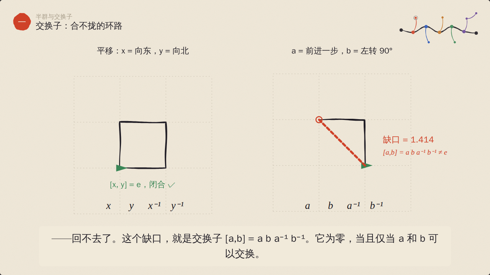
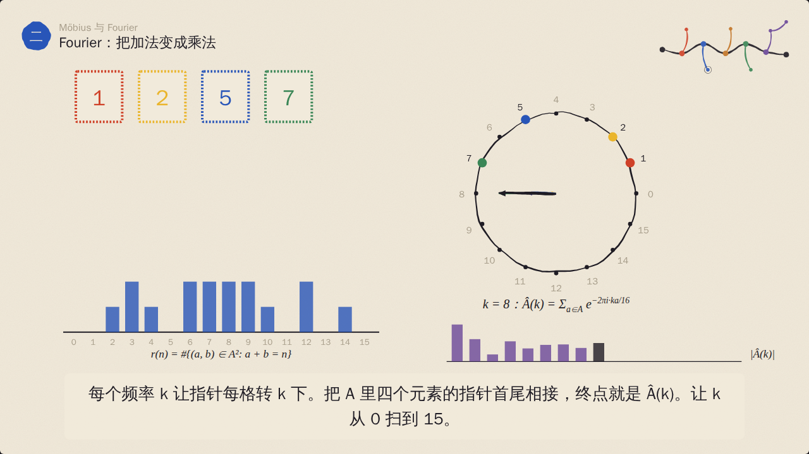
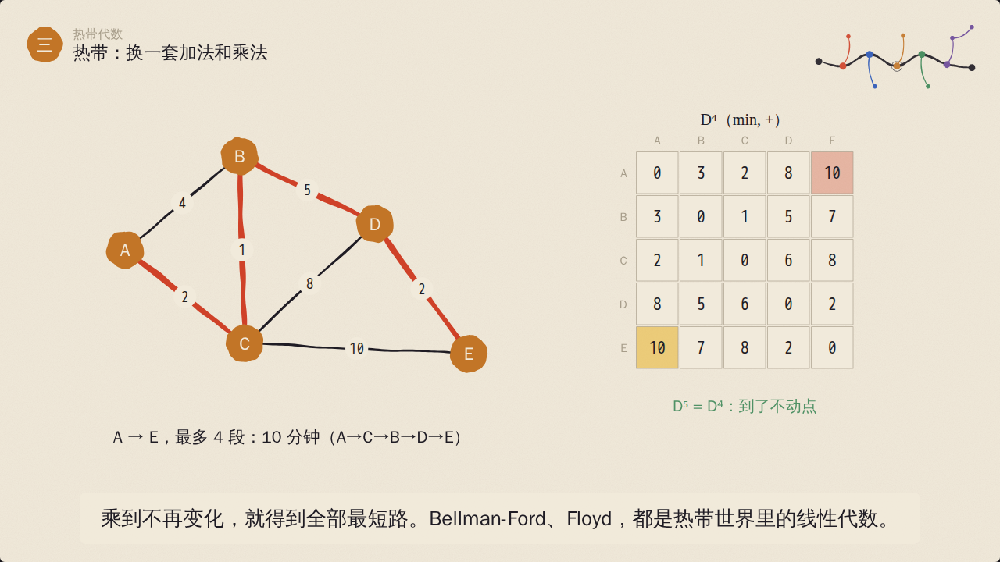
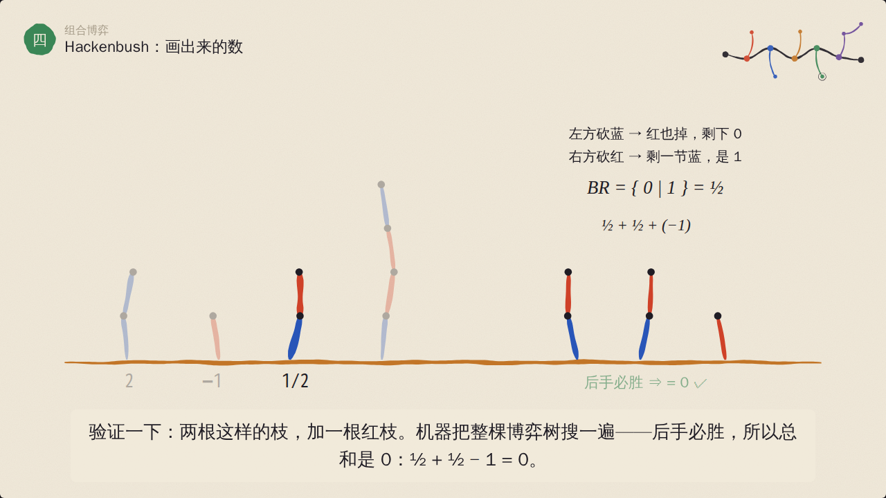
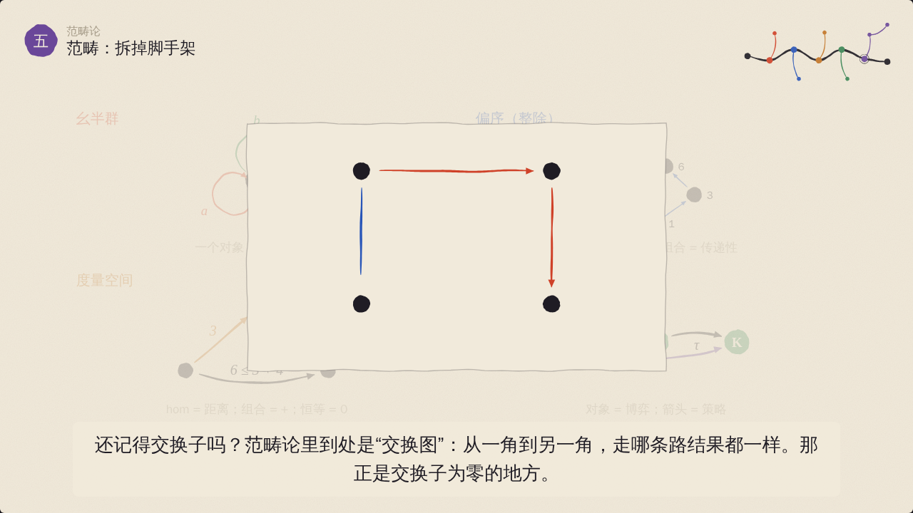
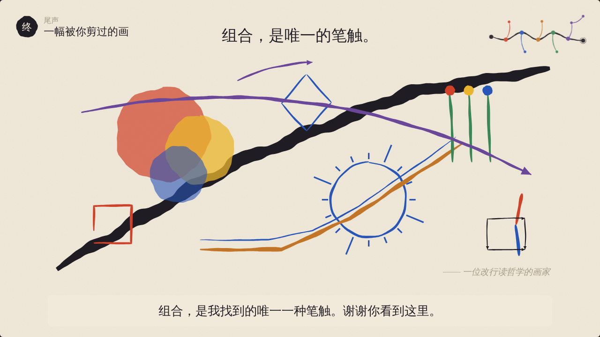

# 知识地图：一幕一幕地看

## 讲述者

我原本画抽象画——康定斯基那一路，圆、三角、斜线、原色。后来改读哲学，回头看自己的画，发现只画过两样东西：点，和点之间的箭头。这部片子是我给写函数式代码的朋友们画的一张地图。

我不打算在画里放公式墙。每一幕先给一个场景：一张桌子、一只乌龟、一本账、一盒邮票、五间画室、三罐画笔、一幅能被砍的画。公式只在场景讲明白之后才出现，而且屏幕上出现的每个数，都是那一刻真算出来的。

## 主线：我们一直在换“加法”是什么

| 幕 | 这一幕的“加法” | 递进到下一幕的那一步 |
|---|---|---|
| 一 结合律 | 叠画纸 `over` | 只要结合律，就能随便切分；要“沿着一张网求和”，还需要交换 |
| 二 ζ 与 μ | 沿偏序累加 Σ | 累加要能撤销，需要减法（群）；可有些世界根本没有减法 |
| 三 换半环 | 取最小 `min` | 加法幂等的世界：最短路、博弈求值都住在这里 |
| 四 Nim | 异或 `⊕` | 被相加的东西变成了博弈本身；博弈与策略又能组合 |
| 五 对象与箭头 | 组合 `∘` | 前面四种加法，都是“箭头组合”的特例 |

每一幕都能单独看懂，但它们是递进的：前一幕留下的问题，就是后一幕的开场。

## 主干与旁枝

主干是一定要讲的东西，旁枝是“顺着这里还能再深一层”。剪掉旁枝，主干依然连贯，这是片子的结构保证（见 README 的“剪枝”一节）。

---

### 序 · 只画两样东西（主干）

- **场景**：画室里的一道黑色斜线、一个红圆。它们褪成背景，只留下三个点和两支箭头。
- **要点**：箭头可以首尾相接地组合，记作 g∘f。
- **对照**：state 收到 action 变成下一个 state，就是一支箭头；`reduce(reducer, s₀, [add, toggle])` 就是一串箭头的组合。
- 片头展示整张知识地图，告诉观众可以按 M 剪枝。

### 一 · 结合律：括号的自由（主干）

- **场景**：四张半透明画纸（红圆、黄三角、蓝方块、黑杠），一张一张叠（foldl，三步）和两两同时叠（树形，两轮）。
- **要点**：两种做法逐像素比较，差为 0——`over` 满足结合律。但 a·b ≠ b·a。半群、幺半群（全透明的纸是单位元）。
- **对照**：action 列表在拼接下是幺半群；`reduce(r, s, [...xs, ...ys]) === reduce(r, reduce(r, s, xs), ys)`，所以可以分批、可以并行。
- **真算的数**：`math/semigroup.js` 用预乘 alpha 的 `over` 在 25×25 个采样点上比较两种括号，Δ = 0.0000。

### 一′ · 交换子：合不拢的环路（旁枝，长在“结合律”上）

- **场景**：一只尾巴拴着画笔的乌龟。
- **要点**：两个平移 x、y 走一圈 x y x⁻¹ y⁻¹ 回到原点；换成“前进 a”和“左转 b”，走完 a b a⁻¹ b⁻¹ 留下一个缺口，这就是交换子。交换子需要逆元，所以要先从半群走进群。
- **对照**：两个副本以不同顺序收到 `inc(2)`、`inc(3)`，结果一致；收到 `set(2)`、`inc(3)`，结果分叉。这正是 CRDT 要求操作可交换的原因。
- **真算的数**：缺口 = √2 ≈ 1.414，来自刚体运动的真实复合。
- **在别处的回响**：范畴论里的“交换图”就是交换子为零的地方（第五幕会提到，前提是这一枝没被剪掉）。

### 二 · ζ 与 μ：累加和它的逆（主干）

- **场景**：画廊访客账本 3, 1, 4, 1, 5, 9, 2, 6。
- **要点**：累计人数是 scan，也就是 ζ 变换；相邻相减把它撤销，这就是 Möbius 变换 μ。把“之前”换成“整除”，12 的因子排成一张网（Hasse 图），欧拉函数 φ 沿网往上累加得到 12，再用 μ(12/d) 的符号 +1、−1、0 反演回 φ(12) = 12 − 6 − 4 + 2 = 4。在子集的网上，同样的反演就是容斥原理。
- **对照**：scan ⟷ ζ，diff ⟷ μ，μ ∗ ζ = δ。
- **递进**：ζ 只需要加法（交换幺半群），μ 还需要减法（交换群）。

### 二′ · Fourier：把加法变成乘法（旁枝，长在“ζ 与 μ”上）

- **场景**：邮局只有 1、2、5、7 四种面值的邮票，贴两张能凑出哪些邮资、各有几种贴法——一个加性问题。
- **要点**：老实做是卷积 r = 1_A ∗ 1_A。钟面上的指针（特征标 χ）把加法变成乘法；每个频率 k 把 A 里的指针首尾相接得到 Â(k)，逐点平方，再变回来，和一对一对数出来的完全一样。哥德巴赫、Roth 定理，都是在频率一侧估计这些箭头有多长。
- **对照**：特征标是 (ℤ₁₆, +) → (ℂˣ, ×) 的同态——第一幕“保持运算”的想法又出现了。
- **真算的数**：直接卷积与经由 DFT 的卷积逐项比较，最大差在 1e-15 量级。
- **在别处的回响**：Nim 的异或是 (ℤ/2)ⁿ 上的加法，它的 Fourier 叫 Walsh–Hadamard；Pontryagin 对偶是一个函子。

### 三 · 热带：换一套加法和乘法（主干）

- **场景**：五间画室送颜料，路上标着分钟数。
- **要点**：矩阵乘法里把 Σ 换成 min、把 × 换成 +，代码一个字不改，只换传进去的半环。D、D²、D³、D⁴ 依次给出“最多 k 段路”的最短时间，A→E 从 ∞ 变成 12、11、10，D⁵ = D⁴ 停在不动点。min 在普通算术里是非线性的，在热带半环里就是加法。热带多项式 max(2, x+1, 2x−2) 的图像是折线。
- **对照**：半环是可以注入的依赖——同一个 `matmul(S)`，传 (+,×) 数走法，传 (∨,∧) 判可达，传 (min,+) 求最短路。
- **递进**：热带加法幂等（a ⊕ a = a），没有减法，所以也没有 μ。

### 三′ · 去量子化：曲线冻成折线（旁枝，长在“换半环”上）

- **场景**：一个你在 softmax 里见过的函数 h·log(Σ e^(v/h))。
- **要点**：把温度 h 从 2 降到 0.02，平滑曲线一点点变硬，冻成上一幕那条折线：log 里的加法变成 max，乘法变成加法。这叫 Maslov 去量子化，h 像普朗克常数。
- **画家的一笔**：水彩干透，变成了木刻。

### 四 · Nim：博弈也能相加（主干）

- **场景**：两个学生从三罐画笔（3、4、5 支）里轮流取笔。
- **要点**：按位异或 3 ⊕ 4 ⊕ 5 = 2 ≠ 0，先手必胜；必胜走法就是每次把异或拨回 0。完整演一局：红方每一步都拨回 0，最后拿走最后一支。三罐画笔是三个小博弈的和，博弈在“和”下构成交换群。Sprague–Grundy：任何公平博弈都等价于一罐 Nim，大小用 mex 算。
- **对照**：“我要最大、你要最小”的 minimax，是 (max, min) 半环上的同一个 fold——热带的影子回来了。
- **真算的数**：整局对弈由 `playNim` 生成，红方用必胜策略、蓝方用固定的笨策略；“拿 1 或 2 支”游戏的 Grundy 值由 mex 递推。

### 四′ · Hackenbush：画出来的数（旁枝，长在“Nim”上）

- **场景**：一幅能被砍的画，地上长着蓝枝和红枝。
- **要点**：两节蓝枝值 2，一节红枝值 −1；一节蓝上接一节红值 ½ = {0 | 1}。两根这样的枝加一根红枝，整棵博弈树搜下来后手必胜，所以 ½ + ½ − 1 = 0。康威把博弈写成 { L | R }——一个递归数据类型，数只是其中特别整齐的一类。
- **对照**：`type Game = { L: Game[]; R: Game[] }`。
- **真算的数**：“BR = {0|1}”由 Conway 的 ≤ 递归比较验证；“后手必胜”由完整搜索得出；BRRB = 3/8 由 Berlekamp 规则读出，并在测试里用博弈比较核对。

### 五 · 范畴：拆掉脚手架（主干）

- **场景**：把前几幅画里的颜色、数字、罐子都拿掉，只留下点和箭头。
- **要点**：范畴 = 对象、箭头、组合、结合律、恒等箭头。然后回头看：
  - 幺半群是只有一个点的范畴（第一幕）；
  - 整除关系是范畴，传递性就是组合，μ 住在它的关联代数里（第二幕）；
  - 度量空间是富集在热带半环上的范畴，三角不等式就是组合（第三幕，Lawvere）；
  - 博弈为对象、策略为箭头，也是范畴（第四幕，Joyal，后来长成博弈语义）。
- **随剪枝出现的两拍**：看过 Fourier，就讲 Pontryagin 对偶是反变函子；看过交换子，就讲交换图是交换子为零的地方。
- 结尾：五个岛，是同一个岛的五幅写生。

### 五′ · 函子：你的 store 就是一个（旁枝，长在“对象与箭头”上）

- **场景**：你的 store。左边是 action 的自由幺半群（一个点，箭头是 action 列表，组合是拼接），右边是四个 state（主题亮/暗 × 语言中/英）。
- **要点**：reduce 把每个 action 列表送到一个 State → State 的函数，保持组合与恒等——这就是函子定律，也是你能分批 dispatch、能做时间旅行调试的原因。Array.map 也是函子，map 融合靠的就是它。
- **真算的数**：对四个 state 逐一检查 `reduce(xs ++ ys) = reduce(ys) ∘ reduce(xs)` 与 `reduce([]) = id`。

### 五″ · 自然变换：只看形状（旁枝，长在“函子”上）

- **场景**：`head : Array a → Maybe a`。
- **要点**：先 map(×10) 再 head，和先 head 再 map(×10)，都得到 Just 10，方块交换。换成“取第一个偶数”，一边是 Just 10、一边是 Just 20，方块不交换。能对所有 a 写出来的变换不可能偷看元素，所以必然自然（Wadler 的“免费定理”）。

### 终 · 一幅被你剪过的画（主干）

- 回到地图，被剪掉的枝只留下铅笔印。主干上标出每一幕的“加法”：over、Σ 沿偏序、min、⊕、∘。
- 每个留下来的节点贡献一个母题，拼成最后一幅画——你剪掉什么，这幅画就少什么，所以每个人看到的最后一幅画都不一样。

## 跨章连线一览

| 从 | 到 | 说的是 |
|---|---|---|
| 结合律 | ζ 与 μ | 在可交换群里才能沿偏序求和 |
| 结合律 | 换半环 | 换一个幺半群，fold 不变 |
| Fourier | Nim | 异或是 (ℤ/2)ⁿ 的加法 |
| 换半环 | Nim | minimax 是 (max, min) 上的递归 |
| 结合律 | 对象与箭头 | 幺半群 = 单对象范畴 |
| ζ 与 μ | 对象与箭头 | 偏序集是范畴，μ 住在关联代数里 |
| 换半环 | 对象与箭头 | 度量空间 = 富集范畴 |
| Nim | 对象与箭头 | 博弈与策略组成 Joyal 范畴 |
| 交换子 | 自然变换 | 交换图 = 交换子为零 |
| Fourier | 函子 | Pontryagin 对偶是函子 |

这些连线定义在 `src/core/graph.js` 的 `LINKS` 里。地图上画成虚线；两端有一端被剪掉，这条线就不画。
