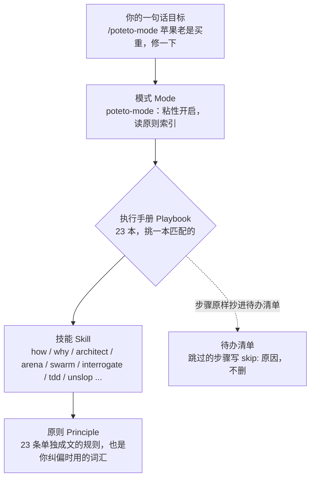

# pstack 设计地图

读完这一页，你应该能回答三个问题：pstack 由哪几层组成，它跟"写一份详细计划再让 AI 执行"有什么不同，以及它靠什么让 AI 的活儿可信。

## 四层结构

**模式（mode）。** [`poteto-mode`](../.claude/skills/poteto-mode/SKILL.md) 是入口。打开之后在整个对话里一直生效。它做三件事：读原则索引，给任务挑执行手册，按规定的风格写回复。

**执行手册（playbook）。** 在 [`poteto-mode/playbooks/`](../.claude/skills/poteto-mode/playbooks/) 下有 23 本，比如 Bug fix、Feature、Prototype、Investigation。挑中之后，手册的步骤要**原样**抄进待办清单的最前面。不做的步骤不能删，要写 `skip: 原因`。这样你一眼就能看出它偷没偷懒。

**技能（skill）。** 执行手册的某一步需要时才调用。比如 Feature 第 1 步调 `how`（弄懂现有代码），第 2 步调 `architect`（先画类型和接口）。

**原则（principle）。** 23 条，每条一个文件，很短。它们有两个用途。一是执行时的判断依据，回复里必须写明"哪条原则改变了哪个决定"。二是**给你的纠偏词汇**：你说一句"apply prove it works"，比写一段话更准，因为 AI 已经读过这条规则的完整内容。

## 它跟"先写计划再执行"有什么不同

大多数"让 AI 做规划"的方法是：先让 AI 写一份详细的需求文档和计划，你审一遍，再让它照着做。pstack 反对把这当成默认做法，理由分散在几个地方：

- 作者原话是"最好的规格说明就是代码"。计划只在多阶段、多 PR 的工作里才写，见 [multi-phase-plan](../.claude/skills/poteto-mode/playbooks/multi-phase-plan.md) 的第 1 步："一两个文件、做法明显的改动，跳过计划。"
- 取代"写计划"的是**可验证的小步**：每一步都以一个能判真假的检查结束，检查通过才走下一步（[sequence-verifiable-units](../.claude/skills/principle-sequence-verifiable-units/SKILL.md)）。
- 取代"开会澄清需求"的是**原型**：能跑一下就看到答案的问题，不该拿来问人（poteto-mode 的 Non-negotiables 第 2 条）。

所以 pstack 的"规划"不是一份文档，而是三样东西：一份原样抄来的步骤清单，一组能判真假的完成条件，一串按顺序提交的小单元。

## 七个核心设计思路

下面每一条都在这次演示里真实用到了，括号里是在哪儿能看到。

1. **路由，而不是清单。** 你只说目标，由它挑执行手册。作者特别提醒别在提示词里罗列"先用 /how 再用 /architect"，因为手册已经排好了顺序，你手写的顺序通常会漏步骤。（[docs/05](05-提示词速查.md)）
2. **能观察的，不问人。** 要问"用哪种方案"之前，先分类：答案能靠运行代码看到，就做原型去看；只有偏好和产品方向才问人。（[docs/01](01-需求澄清.md)，三个问题用原型定）
3. **完成条件必须能判真假。** "做得更好"不行，"跑 4 小时"也不行。要给一个命令或产物，它能通过也能失败。（[docs/02](02-目标明确.md)，`npm run verify`）
4. **在真实产物上验证。** 编译通过不算，单元测试通过也不一定算，要在真实的界面上跑一遍。验证失败时，先怀疑观察方法，再怀疑系统。（[docs/04](04-路径纠正.md)，三次真实纠正都来自这条）
5. **先定数据形状。** 写逻辑之前先说清楚数据长什么样，用一个结构承载领域规则，而不是到处写 if。（[docs/03](03-路线规划.md)，`KINDS` 表）
6. **教训写进结构，不写成提醒。** 同样的话说第二遍时，把它变成脚本、lint 或者类型约束。（`scripts/mutation-check.mjs`）
7. **留下可审计的决策日志。** 每个决策一行：做了什么、为什么、证据、结果。只追加，错了就加一行新的覆盖它，不改历史。（[`decisions.tsv`](../decisions.tsv)）

还有一条这次没用上，但很重要：**多模型对抗**。`/arena` 让几个不同模型对同一个设计各出一版，再取长补短；`/interrogate` 让几个不同模型挑同一份代码的毛病。作者的观点是不同模型盲点不同，两个模型独立发现同一个问题，信号就很强。

## 自治的边界

pstack 默认"不等人"（[never-block-on-the-human](../.claude/skills/principle-never-block-on-the-human/SKILL.md)）：可撤销的事直接做，做完给你看，你事后纠正。但有两类事必须停下来问：

- 不可撤销的操作：强推共享分支、部署、删数据、给外部发消息。
- 产品方向：这由人决定。执行层面不该卡住，方向不归 AI 定。

这次演示里，"要不要做云同步"就是按第二条留给你的，见 [docs/04](04-路径纠正.md) 最后一节。

## 接下来

读 [01-需求澄清](01-需求澄清.md)。
