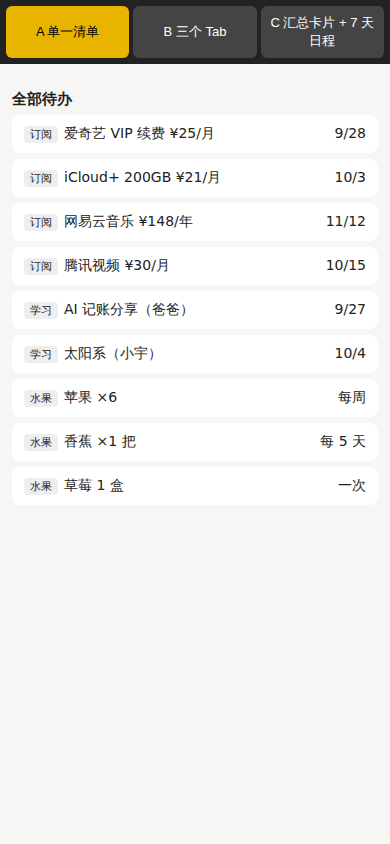
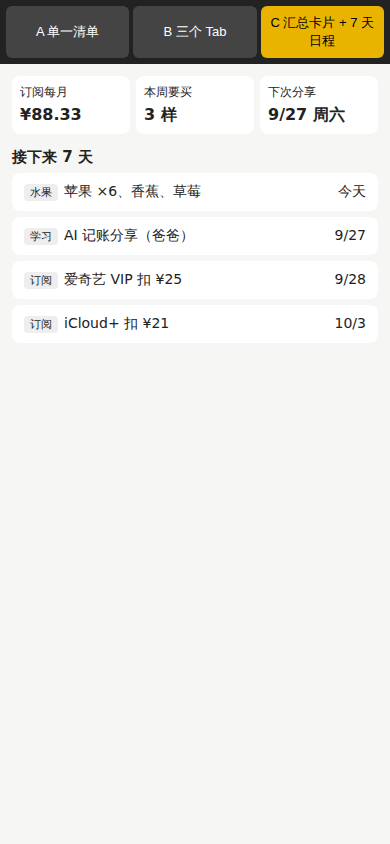

# 需求澄清：能跑出来的答案，不拿去问人

## 起点

你给的原话是："做一个 TODO App，解决家庭中订阅费用、日常水果采购等问题，还有学习分享等活动。"

常见做法是 AI 回一串问题让你答："要不要登录？用什么技术栈？一个列表还是分类？"pstack 不这么做。它的规则写在 [poteto-mode](../.claude/skills/poteto-mode/SKILL.md) 的 Non-negotiables 第 2 条，大意是：

> 准备问"用哪种方案"之前，先给这个问题分类。如果答案是一个运行一下就能看到的事实（行为、时序、布局、输出、性能），它就不归人来回答，去做原型，让结果来决定。只把问题留给实验无法回答的产品或偏好决定。

## 8 个问题，三种处理方式

我把原话拆成 8 个问题，按"谁有资格回答"分成三类：

| # | 问题 | 类型 | 怎么定的 | 结论 |
|---|---|---|---|---|
| 1 | 页面怎么组织：一个清单、分三个 Tab，还是汇总卡片加日程？ | 可观察 | 原型实测 | 汇总卡片 + 7 天日程（C 方案） |
| 2 | 1 月 31 日开通的月付订阅，下个月哪天扣费？JS 自带的日期函数算得对吗？ | 可观察 | 跑一段脚本 | 算不对，要自己写并先写测试 |
| 3 | 数据只存本机（localStorage）够不够单台设备用？刷新会不会丢？ | 可观察 | 端到端测试 P5 | 够，刷新不丢 |
| 4 | 这是一次性待办，还是周期性事务？ | 领域常识 | 订阅按月扣、水果每周买、分享定期办 | 以周期为主，这是最关键的一条 |
| 5 | 订阅有按月的也有按年的吗？ | 领域常识 | 视频会员多按月，音乐和网盘常按年 | 两种都要支持，按月折算总额 |
| 6 | 订阅最该让人看到什么？ | 领域常识 | 痛点是"不知道一共花多少"和"忘了在扣费前取消" | 月总额 + 7 天内要扣费的 |
| 7 | 家里几个人用？要不要多台手机同步？ | **留给你** | 产品方向，要不要上后端和账号 | 先做单机，同步留作待决（见 docs/04） |
| 8 | 要不要记支出历史、做成记账本？ | **留给你** | 偏好 | 默认不做。按 experience-first 原则，功能少而精 |

"领域常识"这一类，是查一下现实世界就能知道的事实，也不该问你。真正问你的只有 7 和 8，而且都先给了默认选择，没有卡住等你（[never-block-on-the-human](../.claude/skills/principle-never-block-on-the-human/SKILL.md)）。

## 原型怎么替你做决定

问题 1 看起来像偏好，其实可以量化。我定了一个可观察的标准：**在手机屏幕（390×844）的首屏上，能不能同时回答三件事：这个月订阅一共多少钱，这周要买什么水果，下次学习分享是哪天。**

按 [Prototype 执行手册](../.claude/skills/poteto-mode/playbooks/prototype.md) 做了三个一次性变体，放在同一个页面里，用按钮切换（[`prototype/index.html`](../prototype/index.html)）。然后写了一个脚本去量（[`prototype/measure.mjs`](../prototype/measure.mjs)）：

```text
┌─────────┬─────────┬───────┬───────┬──────────┬───────┐
│ (index) │ variant │ total │ fruit │ activity │ score │
├─────────┼─────────┼───────┼───────┼──────────┼───────┤
│ 0       │ 'a'     │ false │ true  │ true     │ 2     │
│ 1       │ 'b'     │ true  │ false │ false    │ 1     │
│ 2       │ 'c'     │ true  │ true  │ true     │ 3     │
└─────────┴─────────┴───────┴───────┴──────────┴───────┘
```

| A 单一清单（2/3） | B 三个 Tab（1/3） | C 汇总卡片 + 日程（3/3） |
|---|---|---|
|  |  |  |

A 方案的截图带来了比"选 C"更重要的发现。**经典 TODO 列表根本没有地方放"每月一共多少钱"**，每周都要买的苹果也只能贴个"每周"标签。这说明你要的其实不是一个 TODO App，而是"周期事务 + 汇总"。这是需求澄清阶段最有价值的产出：需求本身被重新定义了。这个发现同时回答了问题 4。

## 一个跑出来的坑

问题 2 用一段 10 行的脚本回答（[`prototype/date-fork.mjs`](../prototype/date-fork.mjs)）：

```text
2026-01-31 + 1 个月 -> setMonth 得到 2026-03-03
2026-01-31 + 2 个月 -> setMonth 得到 2026-03-31
2026-03-31 + 1 个月 -> setMonth 得到 2026-05-01
2024-02-29 + 12 个月 -> setMonth 得到 2025-03-01
```

JS 自带的 `setMonth` 会把"1 月 31 日加一个月"算成 3 月 3 日。如果不跑这一下，月末开通的订阅会被悄悄算错。这不是问你能回答的问题，也不是 AI 凭记忆就一定答对的问题，只有跑一下才确定。

## 原型是一次性的

Prototype 执行手册明确说：原型是一次性的工具，代码质量不重要，做完决定就可以删。`prototype/` 目录保留在仓库里只是为了教学。正式的 App 是在 `app/` 里重新写的，不是把原型改改就上线。

## 你可以这样说

```text
/poteto-mode 新任务。我想做 <一句话需求>。先别写正式代码。
把需求拆成问题。能靠跑原型或脚本看到答案的，直接做出来测；
只有产品方向和个人偏好才问我，而且每个问题先给默认选项。
```

下一页：[02-目标明确](02-目标明确.md)。
