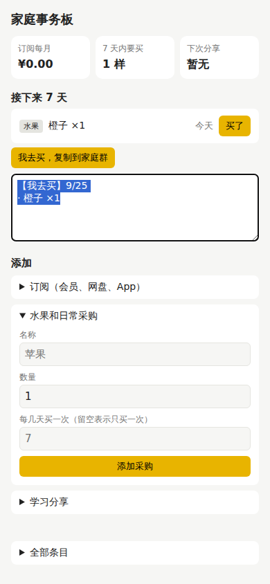

# 路径纠正：信号、原则、动作

这一页有五个纠正案例。**纠正 1、2、3、5 是这次真实发生的**，不是事先安排的，决策日志里都有记录。纠正 4 是演练：家人反馈是我编的剧本，但处理过程是真实执行的，代码也真的改了。

## pstack 的纠偏工具箱

纠偏的难点不在"怎么改"，而在"什么时候该意识到方向错了"。pstack 给每种信号配了一条原则：

| 你看到的信号 | 对应原则或技能 | 该做的动作 |
|---|---|---|
| 验证结果可疑：太容易通过，或者失败得莫名其妙 | [prove-it-works](../.claude/skills/principle-prove-it-works/SKILL.md) | 先怀疑观察方法，再怀疑系统 |
| 有个症状，想加个判空、加个补丁让它消失 | [fix-root-causes](../.claude/skills/principle-fix-root-causes/SKILL.md) | 先复现，一路问"为什么"直到根因 |
| 两次以上基于同一前提的修复都失败了 | [attack-the-premise](../.claude/skills/principle-attack-the-premise/SKILL.md) | 把前提写成一句话，统计数据，质疑前提本身 |
| 同一种绕路写法反复出现；类型要靠强转才能编译；调用方得懂内部规则 | [architect](../.claude/skills/architect/SKILL.md) Phase E | 推翻草图，按新约束从头设计，而且新设计要比旧的**小** |
| 新需求来了，想在现有设计上打补丁 | [redesign-from-first-principles](../.claude/skills/principle-redesign-from-first-principles/SKILL.md) | 假设这个需求第一天就存在，设计会长什么样 |
| 同一句提醒说了第二遍 | [encode-lessons-in-structure](../.claude/skills/principle-encode-lessons-in-structure/SKILL.md) | 写成脚本、lint 或类型约束，删掉那句提醒 |
| 走错了一步 | [show-me-your-work](../.claude/skills/show-me-your-work/SKILL.md) | 日志里**新加一行**覆盖它，不改历史 |

## 纠正 1（真实）：第一次的"红"是假的

**发生了什么。** 按测试先行，我写好测试，还没写实现，运行 `node --test test/`，看到失败，就当它是"红"，提交了。写完实现再跑，还是失败。仔细看报错，是 `Cannot find module '/home/user/learn-alongside/test'`。Node 22 的 `--test` 不接受目录，测试根本没跑到断言。

**对应原则。** prove-it-works："验证失败时，先怀疑观察方法。"

**动作。** 改成 `node --test test/*.test.js`。回到没有实现的状态重跑，确认这次是因为 `app/domain.js` 不存在才失败（真的红），再放回实现看它变绿。修命令单独作为一个提交（`8b4168e`），让审查者看到这个问题。

**教训。** "测试失败了"本身不是证据，要看它**为什么**失败。

## 纠正 2（真实）：测试碰巧通过

**发生了什么。** 所有测试都绿了。我没有停在这里，而是故意往 `todayISO` 里植入 UTC 日期的 bug，看测试能不能抓住。真浏览器的测试抓住了，**但单元测试 P6 没抓住**。

原因是：那条单元测试传的是一个手写的假对象，而植入的 bug 根本不看参数，直接取系统当前时间。这次演示当天的真实日期恰好就是 2026-09-25，正好等于期望值。测试是**巧合通过**的，换一天跑就会暴露。

**对应原则。** figure-it-out Phase C："某个东西通过得太容易时，先怀疑观察方法。"test-behavior-not-implementation："像真正的调用者那样调用代码。"

**动作。** 两件事。第一，把测试改成用真实的 `Date`、真实的时区（`TZ=Asia/Shanghai`），日期选一个离今天很远的 2031-03-01。第二，按 encode-lessons-in-structure，把"植入 bug 看测试会不会红"写成脚本 [`scripts/mutation-check.mjs`](../scripts/mutation-check.mjs)，接进 `npm run verify`。脚本在临时副本里改代码，中途被打断也不会把 bug 留在 `app/` 里。

```text
KILLED   用 UTC 日期当今天
KILLED   忽略传入的时间
KILLED   月末不截断
KILLED   年付不折算成月
KILLED   7 天窗口差一天
KILLED   一次性水果买了还出现
KILLED   没东西要买也发消息
KILLED   过期的分享也算

8 个植入的 bug 全部被测试发现
```

**教训。** 绿色不等于测试有效。要证明测试**会**失败。

## 纠正 3（真实）：只有真浏览器才看得到的 bug

**发生了什么。** 单元测试全绿后，第一次用 Playwright 打开真实页面，浏览器没有显示页面，而是开始**下载文件**。原因是我写的静态服务器在请求 `/` 时调用了 `extname('.html')`，Node 把 `.html` 当成一个隐藏文件名，返回空扩展名，于是首页被当成二进制文件发了出去。

**对应原则。** prove-it-works："跑起来，走一遍真实的功能路径。检查完整链路。"

**动作。** 改成按实际文件取扩展名，端到端 7/7 通过。

**教训。** 每一层测试都有它看不到的地方。这个 bug 在单元测试的视野之外。

## 纠正 4（演练）：家人说苹果买重了

> **剧本设定的反馈：** "上周苹果买重了。我和孩子妈都看到清单，都去买了。能不能加个'认领'按钮？"

这个反馈的典型陷阱是**它自带了解决方案**。直接做一个认领按钮最省事，也最像"听用户的话"。下面是 pstack 的处理方式。

### 第一步：先复现，写下前提

[fix-root-causes](../.claude/skills/principle-fix-root-causes/SKILL.md) 要求先复现。认领按钮这个方案背后有一个没说出口的前提，要先把它写成一句话（attack-the-premise 的第一步）：

> 前提：爸爸和妈妈的手机看到的是**同一份**清单。

这是一个能观察的事实，按 poteto-mode 的规则，不问人，直接做实验。

### 第二步：做实验

[`prototype/two-phones.mjs`](../prototype/two-phones.mjs) 开了两个互相独立的浏览器，模拟两台手机：

```text
爸爸手机上的水果： [ '苹果×6', '草莓×1', '香蕉×1' ]
妈妈手机上的水果： [] （她那边是空的，还在显示"载入示例数据"： true ）
爸爸点了"买了"苹果之后，妈妈手机上的水果： [ '苹果×6', '草莓×1', '香蕉×1' ]
```

**前提被证伪了。** 每台手机各有一份 localStorage。认领记录也只会存在点按钮的那台手机上，另一台看不到。认领按钮做出来也防不了买重。

### 第三步：找根因，分流

根因是：**家里没有一份共享的数据**。解决它有几条路，性质完全不同：

| 方案 | 改动 | 性质 | 谁来定 |
|---|---|---|---|
| A. 做云同步（后端 + 账号） | 大，要服务器、登录、冲突处理 | 产品方向，有持续成本 | **你** |
| B. 托管到带共享存储的平台 | 中，要换部署方式 | 产品方向 | **你** |
| C. 用家里**已经共享**的渠道：微信群 | 小，一个函数加一个按钮 | 可撤销 | 直接做 |

[never-block-on-the-human](../.claude/skills/principle-never-block-on-the-human/SKILL.md) 说："产品方向来自人，执行不该卡住。"所以 A 和 B 留给你，C 先做。

C 为什么对：微信群本来就是家里共享的。有人在群里发"我去买：苹果、草莓"，别人就知道不用买了。微信消息自带发送人，所以 App 里连"我是谁"都不用加（[laziness-protocol](../.claude/skills/principle-laziness-protocol/SKILL.md)）。

### 第四步：最小改动，在真实场景下验证

- 领域层加了一个纯函数 `shoppingMessage`，先写测试（P7），红了再实现。
- 界面加了一个"我去买，复制到家庭群"按钮。

验证时想到一个真实场景的问题。家里人用手机访问电脑上的 App，地址是 `http://192.168.x.x:5173`。这不是安全上下文，浏览器**不提供** `navigator.clipboard`，复制按钮会直接失效。所以加了后备方案：剪贴板不可用时把文字显示出来并全选，让人长按复制。（这个场景的测试一开始是"假装"的，见纠正 5。）



### 这个演练想教的

用户给的解决方案（"加个认领按钮"）是**症状层面**的请求。pstack 的顺序是：写下前提，用实验验证，找到根因，分清哪些是产品决定、哪些可以直接做，然后做最小的那个改动，并在真实场景下验证。

## 纠正 5（真实）：假装的局域网，漏掉了真问题

**发生了什么。** 纠正 4 里，我测"手机通过局域网打开"的办法是：在 localhost 页面上把 `navigator.clipboard` 删掉，假装没有剪贴板。测试通过了。

写这页文档、回头重读代码时，我意识到安全上下文限制的不止剪贴板。`crypto.randomUUID` 也只在安全上下文里有，而 App 每添加一个条目都要用它生成 id。我的假装只删了剪贴板，没删它，所以测不出来。

**复现。** 改用这台机器的真实网卡地址（非 localhost）打开页面，确认 `isSecureContext` 是 `false`，然后添加一个"橙子"。页面上的错误提示是：

```text
crypto.randomUUID is not a function
```

也就是说，改之前，家里人在手机上**一个条目都加不进去**。所有单元测试和之前的 9 条端到端检查都是绿的。

**对应原则。** prove-it-works："在真实的东西上验证，不看代理指标。"我用来"假装局域网"的那一行代码，就是一个代理指标。

**动作。** 加一个 `newId()`，没有 `randomUUID` 时退回到时间戳加随机数。端到端测试改成走真实的非安全地址，还多断言一条"错误提示为空"。之前那条测试没发现问题，是因为错误被表单的 `try/catch` 接住、显示在页面上，没有变成浏览器的异常。

**教训。** 模拟环境只会模拟你想到的那部分。能用真环境，就用真环境。

## 你怎么纠正 AI

pstack 指南第 8 章的建议是：纠偏时说**原则的名字**，一句话就够，因为 AI 已经读过完整规则。

```text
i said the goal is to repro. i did not ask for a fix yet.
apply prove it works. show me the real output, not the build log.
attack the premise. 你已经两次修同一个地方了，先把前提写出来。
subtract before you add. 先删掉旧的，再设计剩下的。
separate before serializing shared state. 每个尝试用自己的 worktree，不要加锁。
```

检查 AI 有没有真的在用原则：它的回复里必须说"哪条原则改变了哪个决定"。只提原则名、说不出具体决定，就是在凑名词。

## 让教训留下来

- 做完一个长任务，说 `/reflect`。它用三个视角回看整段对话，把值得保留的经验变成对具体技能文件的修改建议，**等你批准**才改。
- 同样的纠正说了第二遍，就让它写成脚本。这次的 `mutation-check.mjs` 就是例子。

## 需要你决定的事

1. **要不要多台手机同步**（上面的 A 或 B）。现在的做法 C 能防买重，但订阅和分享的数据仍然每台设备各一份。如果你想让全家看同一份数据，告诉我倾向 A 还是 B，我可以按 figure-it-out 设计这次改造。
2. **要不要记支出历史**（docs/01 的问题 8）。默认不做。

## Attention（自审，未经跨模型复核）

show-me-your-work 要求在交付前，由**另一个模型家族**阅读决策日志和对话记录，指出需要你注意的地方。这次没有做跨模型复核，下面是我自己的审查，分量要打折扣：

- `decisions.tsv` 第 4 行在做出结论**之前**就写好了结果"3 个用原型定，3 个按领域常识定，2 个留给你"。后来的分类确实是这个结果，但严格说这行是先写后证的，而不是事后记录。
- 月总额 ¥88.33 是把年付除以 12 再四舍五入到分。如果你心里的"每月花多少"指的是"这个月实际扣了多少"，那就是另一个数，两者都说得通。
- 端到端测试依赖运行机器有一个非 localhost 的 IPv4 地址，没有的话 P7 局域网那条会直接失败并说明原因，而不是悄悄跳过。
- 端到端测试的时钟是固定的（`setFixedTime`），没有覆盖"页面开着过了午夜"的情况。那时页面不会自动刷新日期，要重新打开或操作一下才更新。
