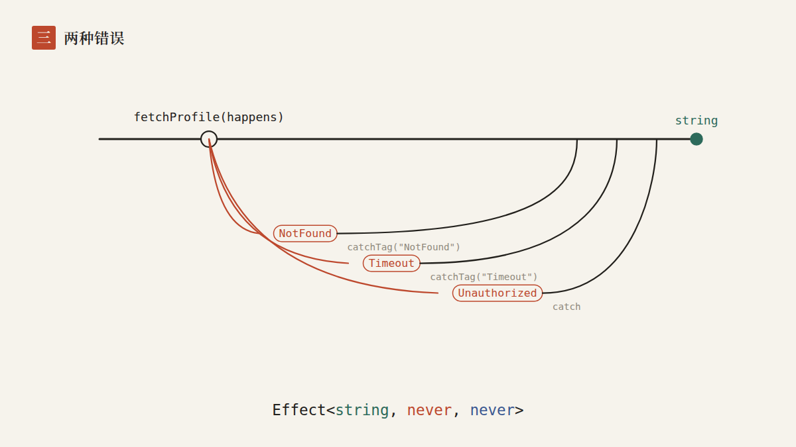
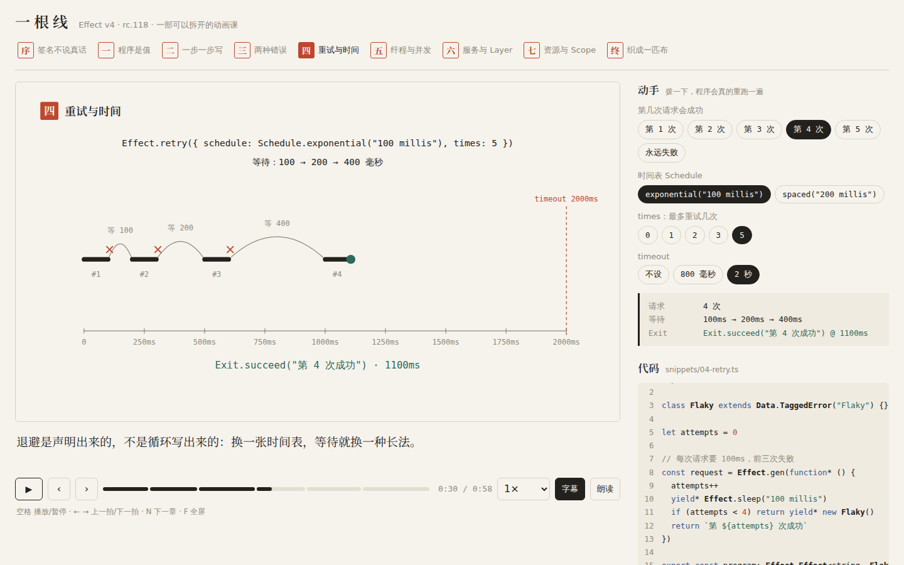
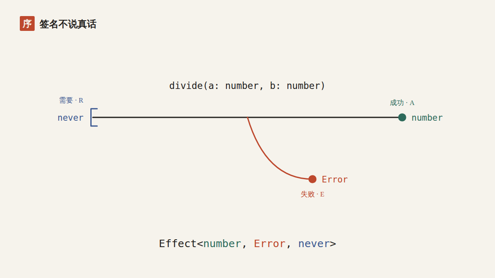
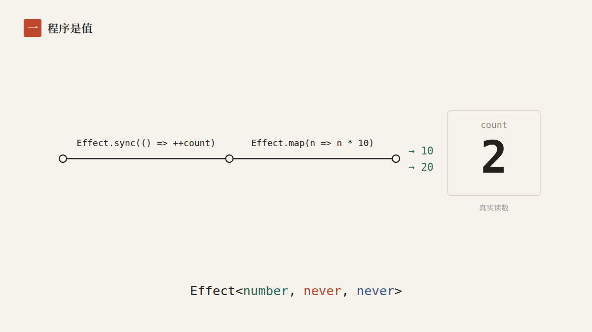
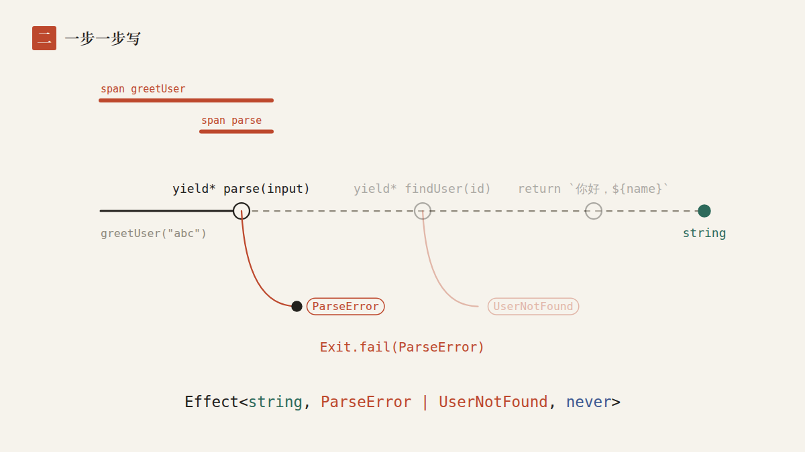
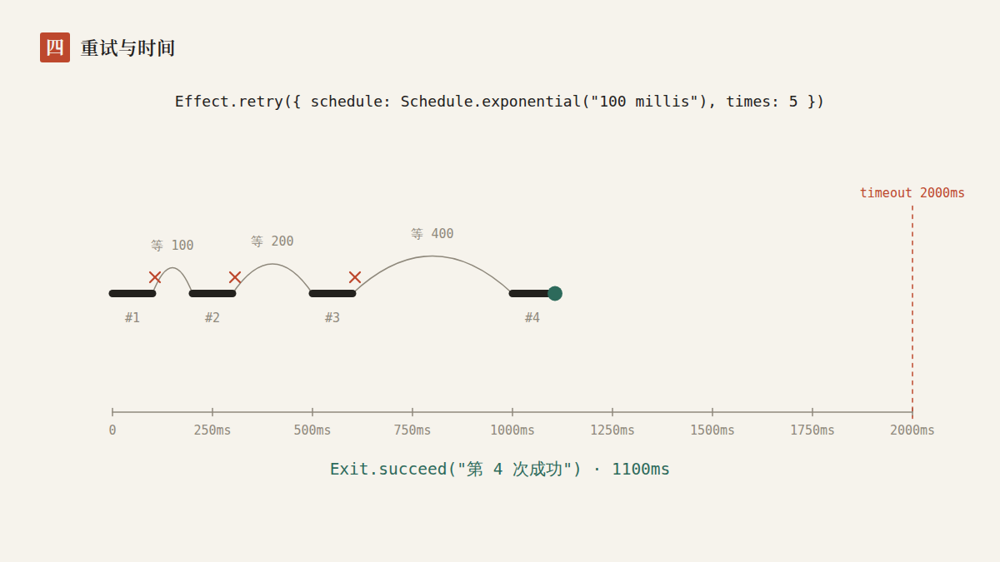
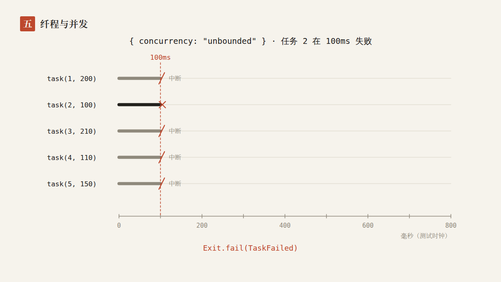
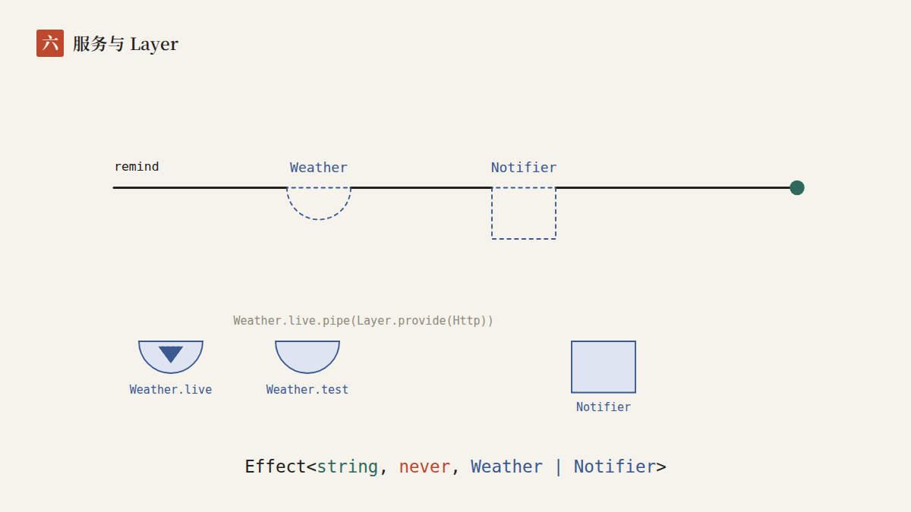
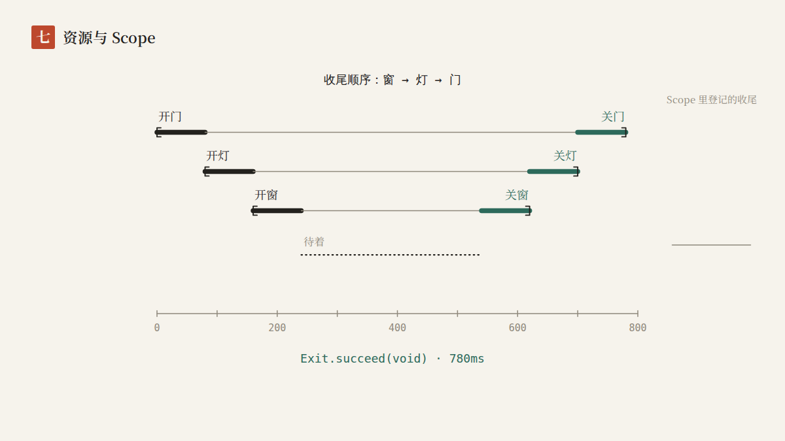
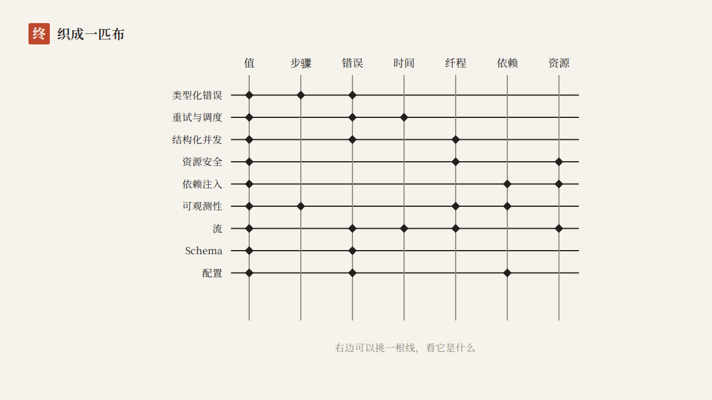

# 一根线：Effect v4 的九段小课

一部可以拆开的动画课。讲 [Effect v4](https://effect.website/docs/v4/onboarding)（`effect@4.0.0-rc.118`）的核心想法和能力范围，在浏览器里放映。

整部课只用一个意象：**一根线**。程序是一根线；还没运行时是虚线，像一张没开工的图纸；运行时有一颗珠子沿着它走。失败是线下面画出来的岔路，依赖是线上的缺口，并发是许多根平行的线，资源是一对括号。最后，这些线织成一匹布。

学习本身是一件有意思的事：把抽象空间里的东西，找到一个看得见、摸得着的样子。这部课尽量克制，只用线、点、字、印和三种颜色：

| 颜色 | 对应 `Effect<A, E, R>` 的 | 在画面里 |
|---|---|---|
| 青 | A：成功的值 | 线的终点 |
| 朱 | E：预期内的失败 | 线下面的岔路 |
| 靛 | R：运行前需要的东西 | 线上的缺口 |

其余一律是墨和铅笔灰。



## 放映

```bash
cd effect-v4
npm install
npm run dev          # 打开终端给出的地址，点“开始”
```

也可以先构建再用静态服务器放：`npm run build && npm run preview`。`dist/` 是纯静态文件，资源路径是相对的，放在任何子路径下都能打开。

| 按键 | 作用 |
|---|---|
| 空格 | 播放 / 暂停 |
| ← / → | 上一拍 / 下一拍 |
| N | 下一章 |
| C | 字幕开关 |
| V | 用浏览器自带的语音朗读旁白 |
| F | 全屏 |

地址栏会记住你在哪一章哪一刻：`?ch=retry&t=30`。`?chrome=0` 只留画面，适合投屏。手机竖着看画面偏小，横过来更清楚；字幕、旋钮和代码在下方。



## 九章

每一章是一段带旁白的动画，右边有旋钮。拨一下，这一章的 Effect 程序会在你的浏览器里**真的重跑一遍**，画面从回放那一拍开始重放，旁白也跟着改写。

| 章 | 讲什么 | 意象 | 你可以拨的 | 对应的官方文档 |
|---|---|---|---|---|
| 序 · 签名不说真话 | 普通函数的签名藏起了 throw；`Effect<A, E, R>` 把三个出口写进类型 | 线在半路断开，值从图外掉下去；换成三个出口 | `b` 是 2 还是 0 | [Why Effect?](https://effect.website/docs/v4/getting-started/why-effect) |
| 一 · 程序是值 | Effect 是惰性的、不可变的描述；`runSync` 才执行 | 虚线图纸，count 的真实读数 | 运行几次、加不加 `map` | [The Effect Type](https://effect.website/docs/v4/getting-started/the-effect-type) |
| 二 · 一步一步写 | `Effect.gen` 像 async/await，第一处失败就短路；`Effect.fn` 产生 span；`pipe` 从外面加行为 | 一站一站的线；没跑到的站还是虚线 | 输入 `"42"` / `"abc"` / `"7"` | [Using Generators](https://effect.website/docs/v4/getting-started/using-generators) |
| 三 · 两种错误 | 带标签的预期错误，`catchTag` / `catch` 让 E 变窄；defect 不在类型里；Cause | 朱色岔路、接回主线的桥、一道裂缝 | 发生什么、接回哪些 | [Two Types of Errors](https://effect.website/docs/v4/error-management/two-error-types) |
| 四 · 重试与时间 | `Effect.retry` + `Schedule`，退避，`timeout` | 时间轴上的请求、等待的弧线、切断的红线 | 第几次成功、时间表、times、timeout | [Retrying](https://effect.website/docs/v4/error-management/retrying) |
| 五 · 纤程与并发 | `Effect.all` 的 `concurrency`、结构化并发的中断、`race` | 五根平行的线，被剪断的斜杠 | 并发数、哪个任务失败 | [Basic Concurrency](https://effect.website/docs/v4/concurrency/basic-concurrency) |
| 六 · 服务与 Layer | R 是缺口；`Context.Service` 定义形状；Layer 是料，自己也可以有缺口 | 半圆、方、三角三种缺口和填进去的料 | 用线上版还是测试版，给不给 Http | [Services](https://effect.website/docs/v4/requirements-management/services)、[Layers](https://effect.website/docs/v4/requirements-management/layers) |
| 七 · 资源与 Scope | `acquireRelease`，倒序收尾；出错、被打断都不漏 | 开门、开灯、开窗；嵌套的括号；一摞登记的盘子 | 正常 / 出错 / 被打断 / 窗打不开 | [Scope](https://effect.website/docs/v4/resource-management/scope) |
| 终 · 织成一匹布 | 开箱能力全景、生态、v4 改了什么、下一步 | 竖线是内核，横线是能力，交叉处打结 | 挑一根线看 | [Welcome](https://effect.website/docs/v4/onboarding) |

完整放一遍大约 9 分钟。每一章、每一个意象具体对应什么，见 [docs/意象词典.md](docs/意象词典.md)。

| | |
|---|---|
|  |  |
|  |  |
|  |  |
|  |  |

## 画面为什么是“真的”

这部课的底线是：**屏幕上演的，就是 Effect 真正做的。**

1. **时间线是录下来的，不是画出来的。** 每一章的实验（`src/labs/`）是一段真的 Effect v4 程序。和时间有关的（重试、并发、资源），放在 `TestClock` 上跑：测试时钟每次往前拨 10 毫秒，所有演示用的时长都是 10 毫秒的整数倍，所以记下来的每个时刻都是精确的。记录器（`src/effect/record.js`）记下事件、`Exit` 和 span，画面只回放这份记录。
2. **span 是观测到的。** 第二章“哪几站跑了”不是推断：记录器装了一个自己的 `Tracer`，收下 `Effect.fn` 自动产生的 span。输入 `"abc"` 时它只收到两个 span，所以图上后面两站是虚线。
3. **屏幕上的代码都能编译、都跑过。** `snippets/*.ts` 是每一章右边显示的代码，`npm run typecheck` 用 `tsc` 对着锁定版本的 `effect` 做类型检查。序、二、三、六章的实验直接调用这些文件；一、四、五、七章的实验是加了记号的同一段程序，测试证明两者跑出同样的结果（10、20；第 4 次成功、1100 毫秒；770 / 460 / 210 毫秒；开门开灯开窗、关窗关灯关门）。
4. **数字和文档对得上。** 第五章五个任务的时长 200、100、210、110、150 毫秒取自官方文档的例子，测试检查 `concurrency: 2` 时的开始顺序和文档的输出一致。

一些从真实运行里看到的细节，也照实画了出来：

- `Schedule.exponential("100 millis")` 的等待是 100、200、400、800……；`times: 2` 最多执行 3 次。
- `timeout` 落在等待中，取消的是还没开始的重试；落在一次请求中间，那一次被中断。
- 一根纤程失败时，`Effect.all` 里其余还在跑的纤程在**同一毫秒**被中断；顺序执行时，后面的任务根本不会开始。
- 窗打不开时，没拿到手的窗不会去关，只倒序还灯和门。
- 忘了给 `Weather.live` 提供 `Http`：类型检查不让过；硬跑的话，运行时报 `Service not found: app/Http`。

## 架构

写过 Elm 或 Redux 的话，会觉得眼熟：

```
旋钮 ──knob──▶ state.knobs ──(effects.js) lab.run(params)──▶ 真实的 Effect 程序（TestClock）
                                                      │
                                     ran(params, trace)◀┘
                                           │
state.runs[章] = { params, trace } ──compose──▶ 时间线（拍长由旁白和记录推出）
                                           │
                    Stage(scene, timeline, run, t) ──▶ SVG（同一组输入永远画出同一帧）
```

- **画面是纯函数。** 每一章导出 `beats`（旁白分拍）和 `View({ clock, params, trace })`。`clock.p('拍名')` 给出这一拍的进度 0..1，`clock.since('拍名')` 用来按真实时间回放记录。没有 `Date`、没有 `Math.random`、没有组件状态，所以任意跳转、改速度都不需要“补帧”，测试里可以在 Node 中把每一拍渲染出来比对。
- **参数和记录成对出现。** 拨了旋钮，画面不会马上用新参数配旧记录，而是等新记录回来，一起换上，再跳到回放那一拍。过时的记录直接丢掉。
- **副作用只在一处。** 时钟（requestAnimationFrame）、键盘、跑实验、地址栏、语音都在 `src/player/effects.js`。

```
snippets/              屏幕上显示的代码，tsc 检查、测试执行
src/
  config.js            可调的旋钮：语速、回放速度、画布尺寸
  course.js            装配：章节顺序、实验、时间线
  effect/record.js     在 TestClock 上跑一段 Effect，记下事件、Exit 和 span
  labs/                每一章的实验：旋钮定义 + 真实运行
  scenes/              每一章的画面与旁白；clothData.js 是终幕的布
  paint/               线、点、字、印、类型签名；缓动；Exit 的写法
  core/                时间线、播放器状态、地址栏（纯函数）
  player/              App（唯一的 useReducer）、舞台、控制条、旋钮与代码面板、副作用
test/                  Vitest：实验说真话、每章每种旋钮组合每一拍都能画、时间线与状态
e2e/smoke.mjs          Playwright：在真浏览器里放一遍构建产物
```

可调的地方在 [src/config.js](src/config.js)：`pace` 决定旁白的语速（汉字一个算一个，代码里的字母按 0.35 个算），`replay.msPerSecond` 决定回放时屏幕上 1 秒对应程序里多少毫秒。改旁白只需要改对应场景里的 `say`，拍长会自动重新计算。

## 加一章

1. 在 `snippets/` 写这一章要展示的代码，`npm run typecheck` 通过。
2. 在 `src/labs/` 写实验：`knobs`、`defaults`、`run(params)`。和时间有关就用 `record`，同步的用 `recordSync`，返回纯数据。时长取 10 毫秒的整数倍。
3. 在 `test/labs.test.js` 写下这份记录应该说的真话（顺序、时刻、Exit）。
4. 在 `src/scenes/` 写场景：`beats`（`say` 可以是参数和记录的函数，`hl` 是代码里要高亮的锚点）和 `View`，`replay` 指向拨旋钮后从哪一拍开始重放。
5. 在 `src/course.js` 登记。
6. `npm run verify`。

## 验证

```bash
npm run verify
```

依次运行：

1. `tsc`：九段屏幕代码对着 `effect@4.0.0-rc.118` 做类型检查。
2. Vitest：实验的记录和文档说的一致（26 条）；每一章的**每一种旋钮组合**都真实跑一遍，每一拍的开头、中间、结尾渲染出来，没有坏数、同一时刻渲染两次相同；高亮锚点都在代码里；第三章画面上的错误类型和代码里的类型标注一致；时间线、状态、地址栏的边界。
3. `vite build`。
4. Playwright：点开始后时间在走、字幕出现；九章 51 拍逐一定位；同一时刻画两次 SVG 相同；第四章把 timeout 拨到 800 毫秒，读数变成 TimeoutError 并从回放拍开始播放；第六章不给 Http，读数里是运行时报出的 `Service not found`；代码面板跟着拍高亮；带参数的链接直达；手机宽度不横向滚动；深色主题生效；全程没有页面错误。

最后输出 `VERIFIED`。`node e2e/smoke.mjs --shots` 会顺便给每一拍截一张图，放在 `e2e/out/`。

## 几个取舍

- **为什么是网页，不是视频。** 参考的是“代码渲染成片”（Video Programming）的做法：画面由代码逐帧算出来，帧是时间的纯函数。但这里不导出视频，因为网页能做视频做不到的事：拨旋钮让程序重跑、暂停在任何一帧、旁白跟着结果改写。
- **为什么用测试时钟。** 真实时钟下，重试和并发的时刻每次都不同，画出来也不可复现。`TestClock` 是 Effect 自己的工具，程序不用改一行，时间就变成确定的。
- **为什么是 SVG。** 文字（中文、代码、类型签名）清晰，缩放不糊；React 组件天然是“状态 → 视图”；在 Node 里也能渲染成字符串做测试。
- **只讲核心。** 官方 onboarding 的学习路径是：Effect 类型、安装、第一个程序、错误处理、并发。这部课沿着它走，再加上服务、资源和全景。Stream、Schema、Config、可观测性只在终幕的布上点到为止，各自的细节请读文档。
- **版本。** 锁定 `effect@4.0.0-rc.118`（2026-09-28 发布）。这是第一个把 `effect/unstable/*` 搬到 `effect/*` 的版本：`effect/unstable/http` 变成了 `effect/http`，ai、cli、sql、rpc、workflow 同理。写这部课时，官方文档和迁移指南里还是 `unstable/` 的写法，终幕的代码以 rc.118 实际能编译的路径为准。
- **网页字体。** 标题和旁白用 Google Fonts 的 Noto Serif SC，离线时退回系统的宋体或衬线字体，不影响使用。

## 资料来源

- 官方 onboarding 与指南：[effect.website/docs/v4](https://effect.website/docs/v4/onboarding)。制作时这台机器访问不了 effect.website，内容取自同一份源文件：GitHub 上 [Effect-TS/website](https://github.com/Effect-TS/website) 仓库的 `apps/web/src/content/docs/v4/`。
- `effect@4.0.0-rc.118` 的源码、`README.md` 和随包附带的 `ai-docs/`（官方给 AI 读的示例）。
- [Effect-TS/effect-smol](https://github.com/Effect-TS/effect-smol) 的 `LLMS.md`、`MIGRATION.md` 和 `migration/`（v3 → v4 的改名表）。
